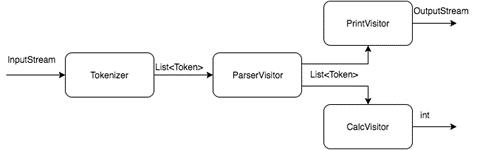
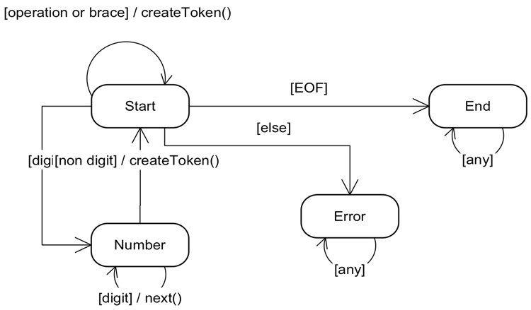

# Лабораторная работа 6

## Цель: получить практический опыт применения паттернов поведения visitor и state.

Необходимо реализовать калькулятор, который умеет преобразовывать простые арифметические выражения в обратную польскую
запись (ОПЗ) и вычислять их. Пример выражения:

```scala
(23 + 10) * 5 - 3 * (32 + 5) * (10 - 4 * 5) + 8 / 2
```

Выражение может содержать скобки, пробельные символы, цифры и 4 операции: ```+, -, *, /```. Для вычисления выражения его
необходимо сначала разбить на токены:

* По одному токену на каждую скобку и операцию;
* Токен для целых чисел.

Пример:

```scala
(30 + 2) / 8 -> LEFT NUMBER (30) PLUS NUMBER(2) RIGHT DIV NUMBER (8)
```

Далее токены преобразуются к ОПЗ, которая уже не содержит скобок и может быть легко вычислена с помощью стека.

```scala
LEFT NUMBER (30) PLUS NUMBER(2) RIGHT DIV NUMBER (8) ->
  NUMBER(30) NUMBER (2) PLUS NUMBER(8) DIV
```

##### Схема работы калькулятора:



* Входной набор данных разбирается на отдельные токены Tokenizer'ом;
* ParserVisitor обходит все полученные токены и преобразует их к обратной польской записи;
* Затем токены печатаются PrintVisitor'ом;
* Значение выражения вычисляется СalcVisitor'ом.

Visitor'ы могут использовать стеки и другие структуры данных, чтобы накапливать в себе промежуточные результаты.

Tokenizer проще всего реализовать в виде конечного автомата, который считывает по одному из символов из входного потока
и преобразует их в токены. Сам автомат необходимо реализовать, используя паттерн State.

##### Схема автомата:



##### Скелет классов:

```java
interface Token {
    void accept(TokenVisitor visitor);
}

interface TokenVisitor {
    void visit(NumberToken token);

    void visit(Brace token);

    void visit(Operation token);
}
```

* NumberToken, Brace, Operation реализуют Token.
* Все Visitor реализуют TokenVisitor.

**В итоге** необходимо реализовать программу, которая с консоли считывает входное выражение и выводит в консоль сначала
выражение преобразованное в обратную польскую нотации, а затем вычисленное значение выражения. Если было введено
некорректное выражение, необходимо вывести ошибку.

[Подробнее про ОПЗ и преобразования в нее](https://ru.wikipedia.org/wiki/Обратная_польская_запись)
